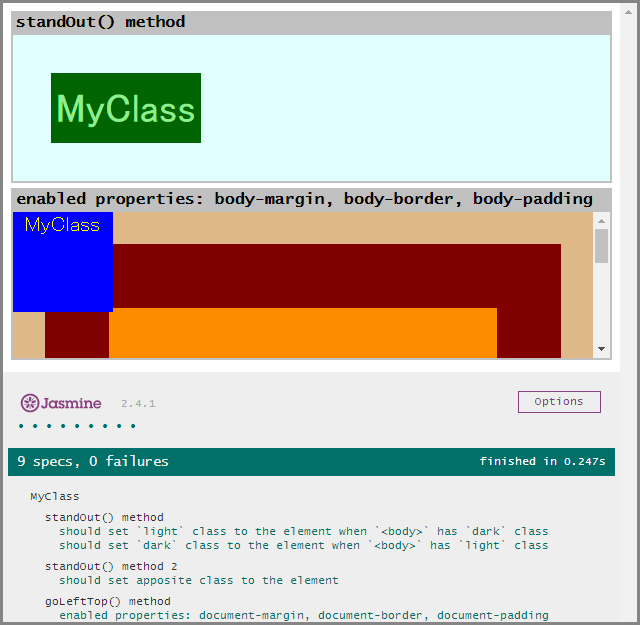

# test-page-loader

[](https://www.npmjs.com/package/test-page-loader) [](https://github.com/anseki/test-page-loader/issues) [](package.json) [](LICENSE-MIT)

Simple helper for unit testing with JavaScript Testing Frameworks (e.g. [Jasmine](http://jasmine.github.io/), [QUnit](https://qunitjs.com/), etc.), to load HTML pages as fixtures.  
This provides a new window (`<iframe>`) for your code which handles DOM, or that which requires independent name spaces (`global`), etc.  
(If you want more features, other great tools such as [jasmine-jquery](https://github.com/velesin/jasmine-jquery) that has many matchers and jQuery supporting will help you.)

**Example (Jasmine): <a href="https://anseki.github.io/test-page-loader/">https://anseki.github.io/test-page-loader/</a>**  
(Each frame is opened by clicking a gray bar.)

[](https://anseki.github.io/test-page-loader/)

**Features:**

- Load HTML pages into `<iframe>` instead of an element like `div#qunit-fixture`. This is useful for tests that need running based on document (i.e. window, `<body>`, etc.), or tests that need independent name spaces (`global`). For example, testing a function that does something according to various document situations, or testing a library that has cache data (i.e. each test code requires initial condition).
- Don't remove the `<iframe>`s that were used for each test and show those on main page, if you want. This is useful for tests that should be checked by looking in addition to the test.
- No dependency library. You need to add just only one file, and this works without depending on anything (even Testing Framework).

## Usage

Load a `test-page-loader.js` file into your main page that is "test runner".

```html
<script src="path/to/test-page-loader.js"></script>
```

A function `loadPage` is provided in global scope (i.e. window).

## `loadPage`

```js
loadPage(url, ready[, title])
```

### `url`

*Type:* string

An URL of the HTML page to load.  
A new `<iframe>` element is added to the main page, and then this URL is loaded.

### `ready`

*Type:* Function

```js
ready(window, document, body[, done])
```

A callback function that is called when the page that was specified by [`url`](#url) was loaded.  
Your test code usually be written in this function, or another function that is called in this function.  
In this function, `window` points a window of `<iframe>` that loaded the [`url`](#url) (i.e. `iframe.contentWindow`). `document` and `body` also are those of `<iframe>` (i.e. these are shortcut to `iframe.contentDocument` and `iframe.contentDocument.body`).  
See [Asynchronous Support](#asynchronous-support) for `done`.

For example, Jasmine:

```js
loadPage('spec/foo-class/bar-method.html', function(window, document, body) {
  body.appendChild(document.createElement('div')); // `body` and `document` in `<iframe>`
  expect(document.getElementsByTagName('div').length).toBeGreaterThan(0);
});
```

QUnit:

```js
loadPage('spec/foo-class/bar-method.html', function(window, document, body) {
  body.appendChild(document.createElement('div')); // `body` and `document` in `<iframe>`
  assert.ok(document.getElementsByTagName('div').length > 0);
});
```

### `title`

*Type:* string

By default, an `<iframe>` element is removed when the testing that used it was finished.  
If the `title` argument is given, the `<iframe>` is kept and shown in the main page for result that should be checked by looking in addition to the test.  
You can pass a string as a heading of the `<iframe>`. If you want to pass the same title to methods of Testing Framework, you can get the title that was specified to it by `document.title` (i.e. a title of the document that is loaded into `<iframe>`). Note that a `document.title` is not changed if it is already set.  
See also: [`window.setTitle`](#windowsettitle)

For example, Jasmine:

```js
// `fixture.html` has no `<title>`.
loadPage('fixture.html', function(window, document, body) {
  it(document.title, function() { // Jasmine prints "FOO should be BAR" in result list.
    // Do something ...
  });
}, 'FOO should be BAR');
```

QUnit:

```js
// `fixture.html` has no `<title>`.
loadPage('fixture.html', function(window, document, body) {
  // Do something ...
  assert.equal(true, true, document.title); // QUnit prints "FOO should be BAR" in result list.
}, 'FOO should be BAR');
```

## Asynchronous Support

If `loadPage` is called multiple times, each requested page is loaded in turn.  
By default, loading next page starts when current [`ready`](#ready) callback was exited. You can make the next loading wait by making the `ready` callback take `done` argument. `done` is callback function, and loading next page waits until `done` callback is called.

For example:

```js
loadPage('page-1.html', function(window, document, body, done) {
  setTimeout(function() {
    done(); // After 3sec., start loading `page-2.html`.
  }, 3000);
  // `ready` is exited here, but don't start loading `page-2.html` yet.
});

loadPage('page-2.html', function(window, document, body) {
  // Do something ...
});
```

Note that testing functions of some Testing Frameworks such as Jasmine work inside of specific scope. Therefore, for example, `it()` function that is called after `describe()` function exited doesn't work.  
If you want to control the sequence of loading pages and testing those, controlling timing to call `loadPage` by Testing Framework (e.g. `done` of Jasmine or `assert.async()` of QUnit) is better than controlling timing to call testing functions by `done` of `ready` callback. (See [Examples](#examples).)

## `window.setTitle`

A window of `<iframe>` that is passed to the [`ready`](#ready) callback has `setTitle` method.  
You can change the [`title`](#title) (heading of the `<iframe>`) that was specified (or not specified) in [`loadPage`](#loadpage).  
For example, load multiple pages, and set the proper title for the each test. Or, set `null` to remove the `<iframe>`, when the test was passed.

For example, Jasmine:

```js
var frameWindow, frameDone, currentSpec;

beforeEach(function(beforeDone) {
  loadPage('page.html', function(window, document, body, done) {
    frameWindow = window;
    frameDone = done;
    beforeDone(); // Make `it()` start when the page was loaded.
  }); // `title` is not yet specified.
});

afterEach(function(done) {
  frameWindow.setTitle(
    currentSpec.result.failedExpectations.length ?
      currentSpec.getFullName() : // 'test-1' and 'test-2' that are specified for `it` method.
      null // Drop this `<iframe>` when all tests are passed.
  );
  frameDone();
  done();
});

var test1 = it('test-1', function(done) {
  currentSpec = test1;
  // Do something ...
  expect(1).toBe(0);
  done();
});

var test2 = it('test-2', function(done) {
  currentSpec = test2;
  // Do something ...
  expect(1).toBe(1);
  done();
});
```

Note that the `setTitle` method works only before `ready` callback is exited or `done` callback is called in [asynchronous mode](#asynchronous-support).

## Examples

If you have not installed test-page-loader yet, install it first.  
You need [Node.js](https://nodejs.org/) (and NPM) installed and available in your `$PATH`.  
Run the following command to install test-page-loader:

```
npm install test-page-loader
```

And, run the following commands for examples:

```
cd node_modules/test-page-loader
npm install
npm run examples
```

Note: The above `node_modules` is a path that the library was installed into. You might want to do the first command with `--only=dev` instead of these commands, but that might not work correctly because version of your NPM has a bug.

And then, access to the following by web browser:

- [http://localhost:8080/test/Jasmine.html](http://localhost:8080/test/Jasmine.html)
- [http://localhost:8080/test/QUnit.html](http://localhost:8080/test/QUnit.html)

The `cd ...` and `npm install` commands are required only a first time.

It uses [node-static-alias](https://github.com/anseki/node-static-alias) and [log4js](https://github.com/nomiddlename/log4js-node) for http accessing.
